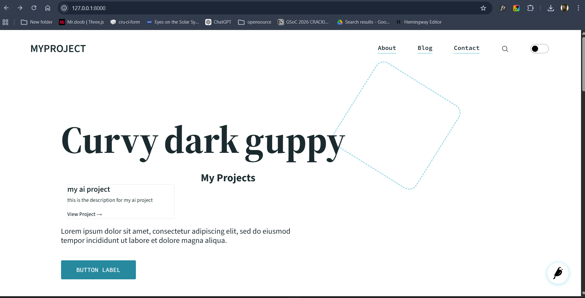
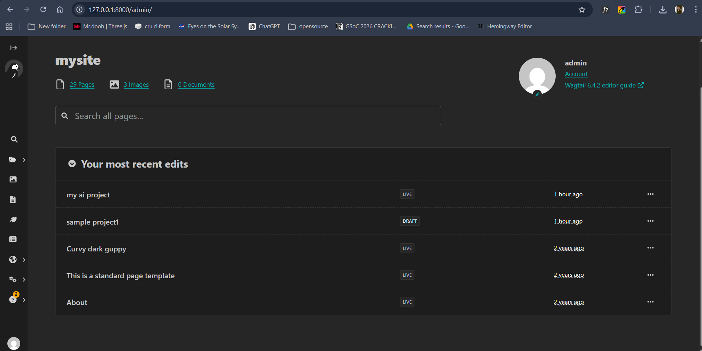
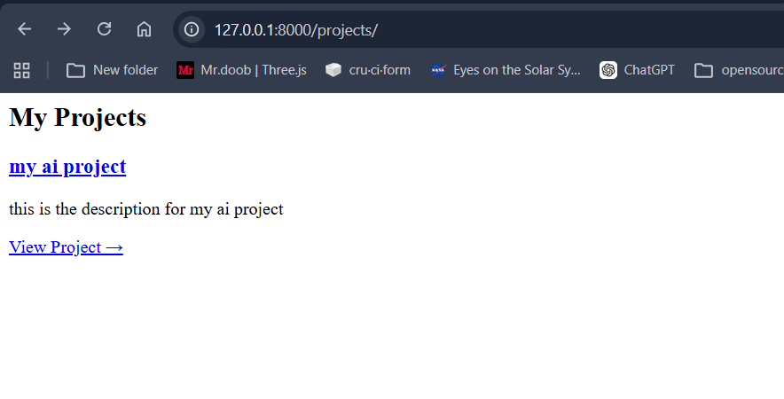

# 🚀 Next-Gen Wagtail Starter Kit (HTMX + Automation Prototype)

An experimental Wagtail starter kit focused on **reducing maintenance overhead, simplifying setup, and improving first-time developer experience (FTDX)**.

## 🎯 Problem Statement

While exploring the official Wagtail starter templates, I identified several issues affecting developer experience and long-term maintainability:

- Multi-step setup process (8+ steps)
- Silent version inconsistencies (e.g. Wagtail downgrade)
- 30+ npm vulnerabilities
- Test suite failures on fresh setup
- High reliance on manual updates

These issues increase friction for new contributors and create ongoing maintenance burden.
## 💡 Approach: Automation + Simplicity

This project experiments with a **subtractive and automation-first approach**:

### 1. Automated Stability
- GitHub Actions (Python + Node matrix)
- Dependabot for dependency updates
- Continuous breakage detection

### 2. Simplified Setup
- One-command project bootstrap
- Reduced manual configuration steps

### 3. Native Onboarding
- Improved demo content (`demo.json`)
- Showcase real Wagtail patterns out of the box
- Avoid external JS onboarding tools


## Highlighted Changes

- Portfolio-focused starter structure
- HTMX-based dynamic projects section
- One-command setup support
- Demo content and screenshots included

## Features

- One-command setup (Windows + Linux/Mac)
- Portfolio-based reusable template
- HTMX-powered dynamic UI (no heavy JS)
- Preloaded demo content
- Cross-platform compatibility
- AI maintenance agent included

## Quick Setup

### 1. Clone

```bash
git clone <repo-url>
cd <project-folder>/mysite
```

### 2. Create and activate virtual environment

Windows (PowerShell):

```powershell
python -m venv env
.\env\Scripts\Activate.ps1
```

Windows (cmd):

```bat
python -m venv env
env\Scripts\activate.bat
```

Linux/Mac:

```bash
python3 -m venv env
source env/bin/activate
```

### 3. Run one-command setup (recommended)

```bash
wagtail-start setup
```

This command already installs Python requirements and runs project initialization.

Optional flags:

```bash
wagtail-start setup --skip-frontend
wagtail-start setup --no-data
```

### 4. Start development server

```bash
wagtail-start dev
```

Open:

- Site: `http://127.0.0.1:8000`
- Admin: `http://127.0.0.1:8000/admin`
- Default credentials: `admin` / `password`

## Alternative Setup Commands

Windows batch setup:

```bat
setup.bat
```

Makefile setup (Linux/Mac or environments with make):

```bash
make setup
make start
```

Note: `setup.bat`, `make setup`, and `wagtail-start setup` all include dependency installation.

## Screenshots

### Homepage with Dynamic Projects Section (HTMX)

<p align="center">
  
</p>

### Wagtail Admin Panel

<p align="center">
  
</p>

### Project Page

<p align="center">
  
</p>


---

## 🤖 AI Usage Disclosure

AI tools were used as an assistive layer during prototyping.

Usage included:
- Exploring setup approaches and automation workflows
- Designing CI/CD structures and dependency management direction
- Drafting and refining documentation
- Iterating on developer experience improvements

Final decisions, implementation, debugging, and validation were performed manually.

AI was treated as a productivity tool — not a source of truth.

## Credits

- [Wagtail](https://wagtail.org)
- [Django](https://www.djangoproject.com/)
- [HTMX](https://htmx.org/)